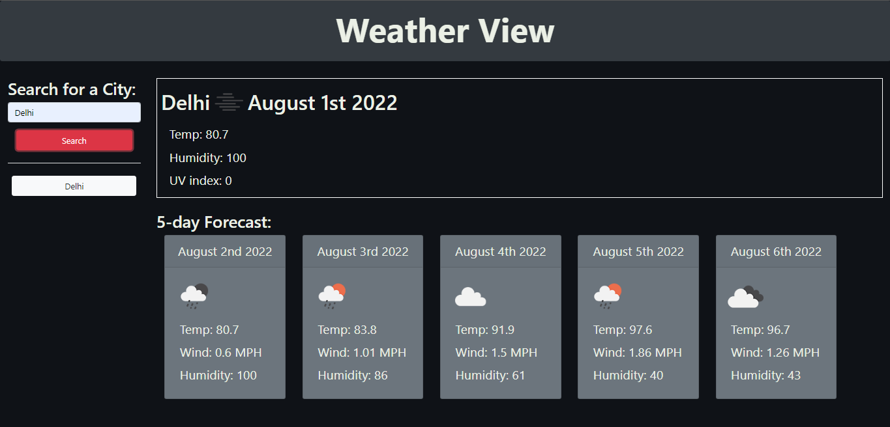

## WELCOME:
This is the README.md for the Challenge Six "Weather App" for the UT Coding Bootcamp.

## BUGS:

1) Only cities are searchable. Openweather's Geocoding API allows for searching via state and country fields but the way it is currently set up, everything is passed through the city fields. So, searching for Springfield, Louisiana will still give you Springfield, Illinois. I will fix this at a future date, but for now, Weather View being city only gets the job done for the class criteria.

2) Shorthand for states, like LA for Louisiana, will completely befuddle the Geocoding API. Best to leave them off. Will be fixed once I clear up bug #1 above.

## CRITERIA: 

```
AS A traveler
I WANT to see the weather outlook for multiple cities
SO THAT I can plan a trip accordingly
```

```
GIVEN a weather dashboard with form inputs
WHEN I search for a city
THEN I am presented with current and future conditions for that city and that city is added to the search history
WHEN I view current weather conditions for that city
THEN I am presented with the city name, the date, an icon representation of weather conditions, the temperature, the humidity, the wind speed, and the UV index
WHEN I view the UV index
THEN I am presented with a color that indicates whether the conditions are favorable, moderate, or severe
WHEN I view future weather conditions for that city
THEN I am presented with a 5-day forecast that displays the date, an icon representation of weather conditions, the temperature, the wind speed, and the humidity
WHEN I click on a city in the search history
THEN I am again presented with current and future conditions for that city
```

[See given mockup here](./assets/images/06_WAPIdemo.png)

## HOW TO:

Click in the search field and type in the city you want to see the weather of. Hit search. The current weather and a five day forecast will be displayed. Search as many cities as you please (unless it's more than 60 in an hour, then please don't, my free API key can only do so much...). Revisit any previous search by clicking the button with the city name on it beneath the search bar.


## SCREENSHOT:


## VISIT:
Please visit [my weather application](https://lawhornmatt.github.io/Ch6_MyWeatherChannel/) to help plan your next trip!

## CREDIT:
Matthew Lawhorn, End July / Beginning August 2022